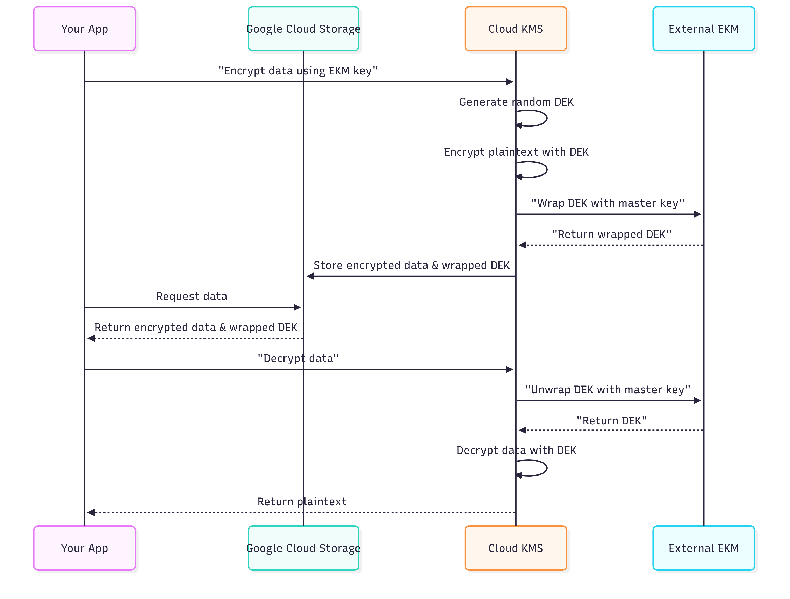

#  Security stuff
## Links
* [Auth decision tree](https://cloud.google.com/docs/authentication#auth-decision-tree)
  
## Impersonating service accounts
1. Alternative to running with key file or with personal account
   1. Appropriate for testing things that will run with service account
   2. Better than creating and distributing keys
   3. Requires user to have permissions to impersonate
      1. Service Account OpenID Connect Identity Token Creator role
      2. Service Account Token Creator role
   4. https://cloud.google.com/docs/authentication#auth-decision-tree
   
2. Example for single call
   ```bash
   gcloud storage buckets list --impersonate-service-account=SERVICE_ACCT_EMAIL
   ```
3. Example - default for all calls
   ```bash
   gcloud config set auth/impersonate_service_account SERVICE_ACCT_EMAIL
   ```

4. Example for ADC
   ```bash
   gcloud auth application-default login --impersonate-service-account SERVICE_ACCT_EMAIL
   ```

5. Example for REST call
   ```bash
   curl -X GET \
    -H "Authorization: Bearer $(gcloud auth print-access-token --impersonate-service-account=PRIV_SA)" \
    "https://cloudresourcemanager.googleapis.com/v3/projects/PROJECT_ID"
    ```

6. Example granting permissions
   ```bash
   gcloud iam service-accounts add-iam-policy-binding PRIV_SA \
    --member=user:CALLER_ACCOUNT --role=roles/iam.serviceAccountTokenCreator --format=json
   ```


## Data Loss Prevention (Sensitive Data Protection)
1. Uses detectors to identify sensitive data
2. Can check data in GCS, BQ, streams
3. Can simply report or can de-identify
   1. redaction
   2. masking
   3. date-shifting
   4. format preserving encryption
   5. etc.
4. Can integrate into Chronicle and SCC

## Key management
1. Autokey is a thing - creation and assignment is automatic, with customer control
2. CMEK requires service integration
   1. Crypto requests handled by resource service agent; are transparent
3. Use CMEK when you need to own/control keys
   1. Control location, creation, access, rotation, destruction, etc.
   2. Set policy about where keys are used
4. CMEK details
   1. Symmetric encryption keys; 256 AES-GCM
   2. Key tracking tells you which resources kse a key
   3. Autokey doesn't support EKM
   4. With hardware-backed keys, key material doesn't leave hardware
   5. Default scheduled for destruction duration is 30 days
5. Resources
   1. Keys
   2. Versions
   3. Keychains (basically, folder of keys in a location)
6. Protection levels
   1. Software
   2. HSM
   3. External
   4. External_VPC
7. EKM
   1. Double encrypting
   